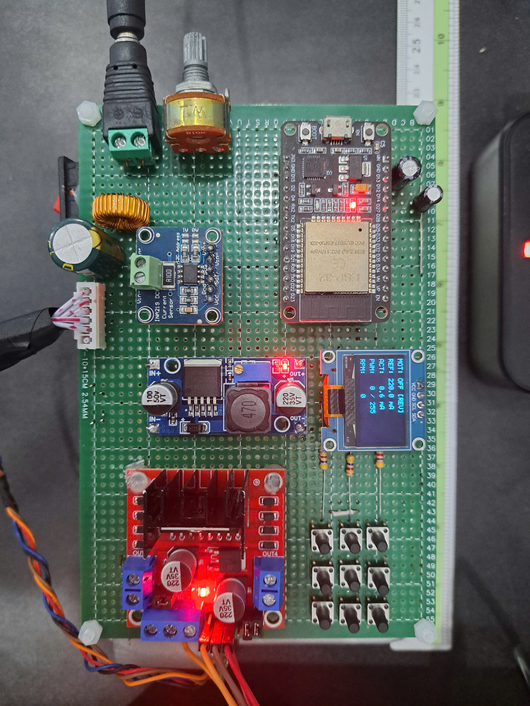
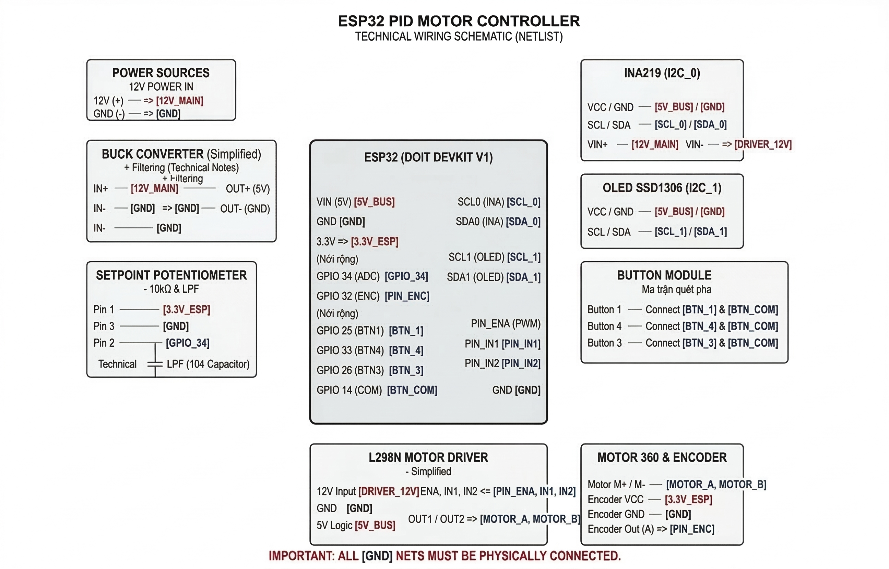

# <h1 align="center">⚙️ ESP32 RTOS PID Motor Controller</h1>

<p align="center">
  
  
  
  
  
</p>

> **A closed-loop DC motor control system** implemented on **ESP32 using FreeRTOS and C++ OOP architecture**.  
> The system provides **real-time monitoring via OLED display** and **wireless PID parameter tuning through a built-in Web Server (Access Point mode)**.

---

## 📋 System Overview

This project demonstrates a **real-time embedded control system** combining:

- RTOS multitasking
- Current loop PID control
- Real-time HMI
- Wireless parameter configuration
- Robust noise filtering techniques

### 🎥 System Demo

<p align="center">
  <a href="./README/video.mp4">
    
  </a>
</p>

---

## ✨ 1. System Features

> **Note:** The features below represent the core capabilities of the RTOS controller.

### 🔄 RTOS Multi-Tasking
Independent processing tasks distributed across **ESP32 dual cores**.

| CPU Core | Responsibility |
| :---: | :--- |
| **Core 0** | HMI / Web server |
| **Core 1** | Real-time control loop |

### 🛜 Web-Based PID Tuning
The ESP32 operates as a **WiFi Access Point**

```text
IP Address: 192.168.4.1

```

PID parameters can be adjusted **in real time without firmware reflashing**.
Supported parameters:

* $K_p$
* $K_i$

### 🖥️ Real-Time HMI

OLED display supports two visualization modes:

* **Text Mode** – static system parameters
* **Graph Mode** – real-time current waveform visualization

### 🛡️ Robust Noise Filtering

Several hardware and software techniques are used to ensure signal integrity.

**Analog Filtering**

* Hardware Low-Pass Filter (0.1µF capacitor)
* Oversampling ADC
* EMA digital filtering

**Encoder Protection**

* Time-based interrupt debounce (1000 µs)

**Setpoint Stabilization**

* Quantization step of **5 mA**

**Button Input Protection**

* Double-read validation to reject EMI interference

### ⚡ Power Protection

Power architecture with isolated voltage domains:

```text
12V  → Motor Power
5V   → Logic supply
3.3V → ESP32

```

Includes:

* Schottky diode reverse protection
* Bulk filtering capacitors
* Decoupling capacitors for logic circuits

---

## 🛠️ 2. Hardware Architecture

### 📦 2.1 Bill of Materials (BOM)

| Component | Description |
| --- | --- |
| **Controller** | ESP32 DOIT DevKit V1 |
| **Motor Driver** | L298N H-Bridge |
| **Motor** | DC Motor 360 (12V, 7000RPM) |
| **Encoder** | 4 PPR incremental encoder |
| **Current Sensor** | INA219 High-Side Current Sensor |
| **Display** | OLED SSD1306 0.96" |
| **Power Supply** | 12V Adapter |
| **Buck Converter** | LM2596 |
| **Passive Components** | Electrolytic capacitors, ceramic capacitors, Schottky diode, potentiometer |

### 🔌 2.2 Pin Mapping & Schematic

<div align="center">

</div>

| ESP32 Pin | Net Label | Type | Description |
| --- | --- | --- | --- |
| **VIN** | `5V_BUS` | PWR | Logic power from LM2596 |
| **GPIO34** | `GPIO_34` | ADC | Potentiometer setpoint input |
| **GPIO32** | `PIN_ENC` | INT | Encoder channel A interrupt |
| **GPIO21** | `SDA_0` | I2C | INA219 SDA |
| **GPIO22** | `SCL_0` | I2C | INA219 SCL |
| **GPIO23** | `SDA_1` | I2C | OLED SDA |
| **GPIO19** | `SCL_1` | I2C | OLED SCL |
| **GPIO14** | `BTN_COM` | GPIO | Button matrix common pin |
| **GPIO25** | `BTN_1` | INPUT | Motor Start / Stop |
| **GPIO26** | `BTN_3` | INPUT | Display Mode Toggle |
| **GPIO33** | `BTN_4` | INPUT | Web Config Mode |
| **GPIO13** | `PIN_ENA` | PWM | PWM output to L298N |
| **GPIO12** | `PIN_IN1` | OUTPUT | Motor direction control |
| **GPIO27** | `PIN_IN2` | OUTPUT | Motor direction control |

> **Important:** All modules must share a **common ground**:
> ESP32, L298N, INA219, LM2596, Encoder

---

## 🧠 3. Firmware Architecture

The firmware is implemented using:

* ESP-IDF + PlatformIO
* FreeRTOS
* C++ Object-Oriented Design

Two main tasks operate concurrently.

### ⚙️ 3.1 Task Allocation

**TaskControl**

```text
Core: 1
Priority: 3
Loop period: 50 ms

```

Responsibilities:

* Read current measurement from INA219
* Read filtered ADC setpoint
* Execute PID current controller
* Generate PWM signal
* Control motor direction

**TaskHMI**

```text
Core: 0
Priority: 2
Loop period: 100 ms

```

Responsibilities:

* Process encoder pulses and compute RPM
* Scan input buttons (non-blocking)
* Update OLED display
* Manage Web Server AP mode

> Synchronization between tasks is implemented using: `FreeRTOS SemaphoreHandle_t`

---

## 📡 4. Signal Processing Algorithms

### ADC Filtering

The potentiometer signal is filtered using:

* Oversampling (10 samples)
* EMA Low-Pass Filter

```cpp
filtered_adc = (0.3f * avg) + (0.7f * filtered_adc);

```

### Setpoint Quantization

Setpoint resolution is limited to **5 mA steps** to prevent display oscillation.

```cpp
g_setpoint_mA = (float)(((int)(raw_setpoint + 2.5f) / 5) * 5);

```

### Encoder Interrupt Debounce

Motor brush sparks may cause **false encoder interrupts**.

* Maximum speed: `7000 RPM`
* Minimum valid pulse interval: `≈2142 µs`

The ISR therefore validates pulses using a **time threshold**.

```cpp
int64_t current_time = esp_timer_get_time();

if (current_time - instance->last_pulse_time > 1000)
{
    // Valid pulse
}

```

---

## 🚀 5. Build and Flash

### Development Environment

* VSCode
* PlatformIO
* ESP-IDF Framework

### Build

```bash
pio run

```

### Flash

```bash
pio run --target upload

```

---

## 📐 6. System Dynamics and Control Analysis

The control system is based on **current loop control** of a DC motor.

The electromechanical model is described by two coupled differential equations:

### Electrical Equation

$$V_a(t)=R_a i_a(t)+L_a \frac{di_a(t)}{dt}+e_b(t)$$

### Mechanical Equation

$$T_m(t)=J\frac{d\omega(t)}{dt}+B\omega(t)+T_L(t)$$

### Electromechanical Coupling

Back-EMF:


$$e_b(t)=K_e\omega(t)$$

Torque generation:


$$T_m(t)=K_t i_a(t)$$

### Control Strategy

The system implements a **current loop PI controller**


$$C(s)=K_p+\frac{K_i}{s}$$

> Derivative action is intentionally omitted due to **high-frequency PWM noise**.

### Anti-Windup Protection

The actuator is limited by supply voltage:

```text
PWM ∈ [0,255]

```

When saturation occurs:

```text
PWM = 255

```

Integral accumulation is disabled to prevent **integral windup**.

---

# License

This project is licensed under the [MIT License](LICENSE).

---