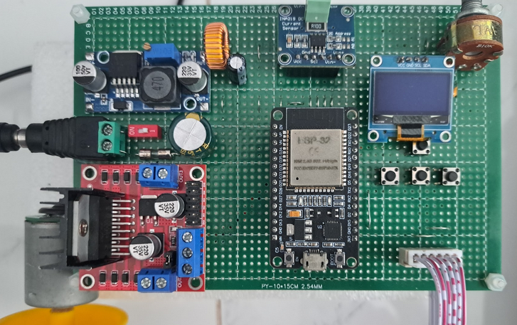
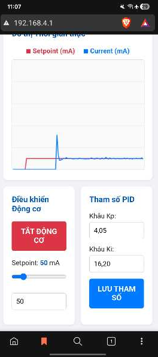

<h1 align="center">🚀 ESP32 DC Motor Current Stabilization</h1>

  
  
  
  
  

  <i>Hệ thống điều khiển vòng kín sử dụng vi điều khiển ESP32 nhằm tự động bù trừ tín hiệu <b>PWM</b>, duy trì ổn định dòng điện tiêu thụ của động cơ DC khi tải trọng cơ học thay đổi.</i>

 

-----

# 🚀 ESP32 DC Motor Current Stabilization under Variable Load

> 💡 **Mục tiêu dự án:** Hệ thống điều khiển vòng kín sử dụng vi điều khiển ESP32 nhằm tự động bù trừ tín hiệu **PWM**, duy trì ổn định dòng điện tiêu thụ của động cơ DC khi tải trọng cơ học biến thiên liên tục.

Đề tài giải quyết bài toán chống suy giảm tốc độ/moment xoắn và ngăn chặn hiện tượng quá dòng, kẹt rotor trong các hệ thống cơ điện tử di động.

-----

## 🏗️ 1. Kiến trúc Hệ thống

Hệ thống được thiết kế theo kiến trúc phân tán tác vụ sử dụng **FreeRTOS** để tối ưu hóa hiệu năng, tách biệt hoàn toàn logic điều khiển thời gian thực và giao thức truyền thông.

  * 🧠 **Core 0:** Xử lý stack Wi-Fi (AP Mode) và Web Server bất đồng bộ (Asynchronous HTTP).
  * ⚙️ **Core 1:**
      * `TaskControl` *(50ms)*: Chạy thuật toán PID số, đọc ADC (Potentiometer), và giao tiếp I2C với INA219 (Sensor).
      * `TaskHMI` *(20ms)*: Quét nút nhấn (Debounce logic), cập nhật màn hình OLED và điều khiển Buzzer.

-----

## 🧮 2. Lý thuyết Điều khiển & Bộ lọc

Hệ thống điều khiển dòng điện (Current Loop) yêu cầu tốc độ đáp ứng cao. Do bản chất chổi than của động cơ DC gây ra nhiễu tần số cao, các phương pháp sau được áp dụng:

### 📉 Bộ lọc EMA

Áp dụng cho dữ liệu thô từ INA219 đóng vai trò như Low-pass filter bậc 1 để giảm nhiễu gai (spikes) trước khi đưa vào khâu tính toán:
$I_{filtered}[k] = 0.2 \cdot I_{meas}[k] + 0.8 \cdot I_{filtered}[k-1]$

### 🎯 Bộ điều khiển PI số

Sử dụng thuật toán PID vị trí với cơ chế **Anti-windup** (ngăn tích phân bão hòa khi PWM đạt 100%). Thông số được thiết lập theo Ziegler-Nichols:

  * **$K_p$:** `4.05`
  * **$K_i$:** `16.2`
  * **Sampling Time ($T_s$):** `50ms`

-----

## 🔌 3. Cấu hình Phần cứng

  * **MCU:** ESP32 Development Board (ESP-WROOM-32)
  * **Motor Driver:** L298N (Tần số 5KHz, Resolution 8-bit)
  * **Current Sensor:** INA219 (I2C Fast Mode 400kHz)
  * **HMI:** OLED SSD1306 (I2C), Rotary Encoder, 4 Push Buttons, Passive Buzzer.

| Phân hệ | Chân tín hiệu | ESP32 GPIO | Ghi chú |
| :--- | :--- | :--- | :--- |
| ⚡ **L298N** | `ENA` | **GPIO 13** | LEDC Channel 0, 5KHz (PWM) |
| | `IN1` | **GPIO 14** | Điều khiển chiều quay |
| | `IN2` | **GPIO 27** | Điều khiển chiều quay |
| 🔎 **INA219** | `SDA0` / `SCL0` | **21** / **19** | Bus I2C0 |
| 📺 **OLED** | `SDA1` / `SCL1` | **22** / **23** | Bus I2C1 |
| 🎛️ **Sensors** | `POTENTIOMETER`| **GPIO 34** | ADC1 Channel 6 |
| | `ENCODER` | **GPIO 4** | External Interrupt |
| 🕹️ **HMI** | `BTN_UP` | **GPIO 26** | Pull-up nội |
| | `BTN_DOWN` | **GPIO 18** | Pull-up nội |
| | `BTN_LEFT` | **GPIO 5** | Pull-up nội |
| | `BTN_RIGHT` | **GPIO 25** | Pull-up nội |
| | `BUZZER` | **GPIO 32** | Active High |

-----

## 🌐 4. Web Dashboard

Khi hệ thống chuyển sang **Mode 5**, ESP32 tự động phát Wi-Fi (Access Point) và khởi tạo Web Server lưu trữ trực tiếp trên bộ nhớ Flash.

> 📶 **Thông tin kết nối:**
>
>   * **SSID:** `ESP32_PID_TUNING`
>   * **Password:** `12345678`
>   * **IP Access:** `http://192.168.4.1`

**Tính năng UI:**

1.  Theo dõi realtime đồ thị $I_{ref}$ (Setpoint) và $I_{meas}$ (Current) qua API `fetch` (200ms interval).
2.  Live tuning thông số **Kp, Ki** trực tiếp.
3.  Điều khiển Start/Stop động cơ từ xa.

-----

## 🛡️ 5. An toàn

Mã nguồn được thiết kế nghiêm ngặt tính đến yếu tố an toàn:

  * 🛑 **Deadband Protection:** Nếu Setpoint \< `5.0mA`, hệ thống tự động xóa bộ nhớ tích phân khâu I, xuất PWM = 0 và ngắt động cơ để tránh hiện tượng giật cục sập nguồn do nhiễu ADC vi sai.
  * 🔒 **Saturate Handling:** Khâu PID tự động ngừng cộng dồn (clamp) sai số tích phân nếu giá trị PWM xuất ra $\ge 255$ hoặc $\le 0$.
  * 🚦 **Mutex Data Lock:** Mọi biến toàn cục chia sẻ giữa Web Server, TaskControl và TaskHMI đều được bảo vệ bởi `SemaphoreHandle_t` nhằm tránh Data Race Condition giữa các Core xử lý.

-----

📝 **Tác giả:** Nguyễn Nhật Đăng (B2304624) - Đại học Cần Thơ (CTU)  
📅 **Cập nhật:** Tháng 4/2026 | **Version:** 1.1.0